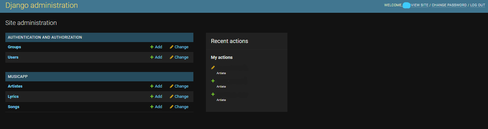
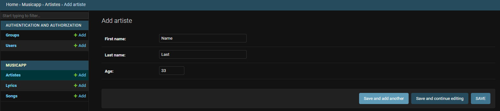

# Week 5 Backend Stack 2: Python Task

## 📝 This is a task for I4GxZuri

### 📜 Task Title

- Django CRUD

### ✍ Instructions

1. We would be building a simple song CRUD application. In our models.py file inside the “musicapp” application we created, you are expected to add the following Models and Attributes

- Model: Artiste, Song, Lyric
- Attributes for “Artiste” : first_name, last_name, age
- Attributes for “Song” : title, date released, likes, artiste_id
- Attributes for “Lyric”: content, song_id

2. As you might have guessed, there is a relationship between all three Models. An Artiste can have multiple songs, and a song can have multiple lyrics.A song must only belong to one Artiste and a lyric must only belong to a song. You are to specify the foreign key relationship yourself.

3. Also, the model field attributes should be specified by you.

### 📚 Resources

1. [Intro to models and relationships](https://www.youtube.com/watch?v=9rUM9SLdMkw&list=PLxuUHF3OiqfWAITD4gPUHZ1GcYRqmyF7P&index=50&t=381s)
2. [Adding our models to admin interface](https://www.youtube.com/watch?v=NfKWrxlnFZM&list=PLxuUHF3OiqfWAITD4gPUHZ1GcYRqmyF7P&index=49&t=128s)
3. [Creating data](https://www.youtube.com/watch?v=Eie-oPmNYag&list=PLxuUHF3OiqfWAITD4gPUHZ1GcYRqmyF7P&index=48)
4. [Fetching data from a database](https://www.youtube.com/watch?v=sDanrV0awQY&list=PLxuUHF3OiqfWAITD4gPUHZ1GcYRqmyF7P&index=47)
5. [Updating and deleting items](https://www.youtube.com/watch?v=PRSZRDrrGYY&list=PLxuUHF3OiqfWAITD4gPUHZ1GcYRqmyF7P&index=46)
6. [Entity and Relationship, Models and admin, loading environment variables](https://www.youtube.com/watch?v=9LQA56KGsBE)
7. [Models](https://docs.djangoproject.com/en/4.1/topics/db/models/)
8. [Python Office Hour with Enny](https://www.youtube.com/watch?v=CATSNHO1rn0)
9. [Python Office Hour with Enny](https://www.youtube.com/watch?v=XlDxrMNIvZc&list=PLxuUHF3OiqfUL4JHM5iiLEdoNJBMqyCbq&index=159)
10. [Python Office Hour with Femi](https://www.youtube.com/watch?v=HwY9Ym98LSA&list=PLxuUHF3OiqfUL4JHM5iiLEdoNJBMqyCbq&index=160)

### 🔧 Tools

- Django version 4.1.2
- Python version 3.10.4
- Visual Studio Code version 1.72.2
- Git 2.36.1
- Github repository

### 📌 Important links

- Django: https://www.djangoproject.com/
- Python: https://www.python.org/
- Visual: Studio Code https://code.visualstudio.com/
- Git: https://git-scm.com/
- Github: https://github.com/

### 🔑 License

[MIT](LICENSE)

### 📂 Project samples

1. Database relationships

2. Server running after python manage.py runserver (initiation)

  
3. General view

5. Artiste 

6. Song

## ⭐ Thanks I4GxZuri Team and Mentors 🏅
